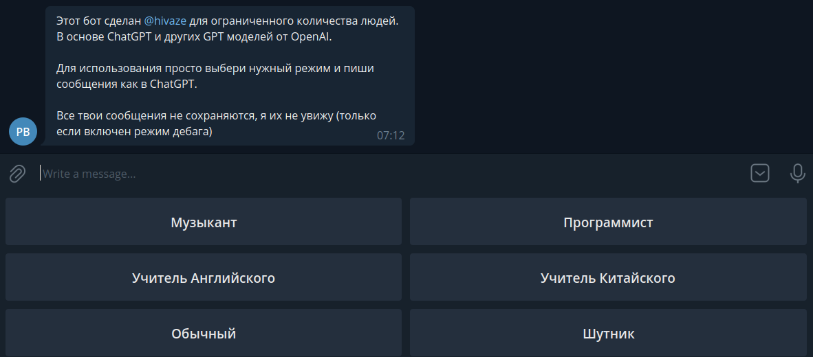
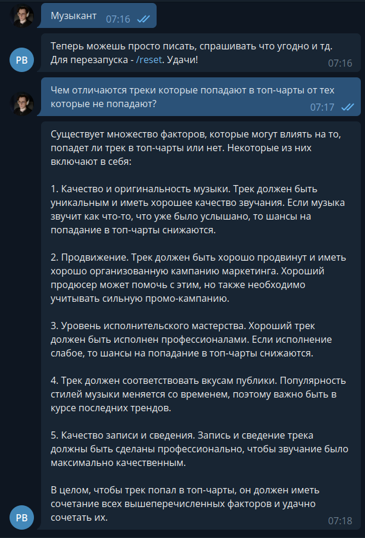

## Приватный телеграм бот на основе ChatGPT

Бот с несколькими персонажами для доступа по вашему OpenAI ключу к API gpt-3.5 (chatgpt).

Используемых фреймворков всего два: `aiogram` и `openai` для Python

Вы можете настроить все необходимые параметры, включая список разрешенных пользователей в `resources/config.json` \
Там же должны находиться ключи для телеграма и openai.

Запуск после установки зависимостей и настройки просто: `python main.py`

### Текущие персонажи

Персонажи настраиваются в `resources/personalities.json`

### Пример работы

