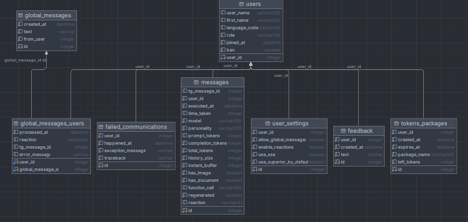

## Smart Telegram Bot based on ChatGPT

An asynchronous bot with multiple characters for accessing the gpt-3.5 and gpt-4 API (chatgpt) via your OpenAI key. It can work with documents and the internet, and interprets images using BLIP.

### Bot's address
t.me/personalized_ai_bot - you can try it right now if the bot is in global mode.

### Features
- **Full Asynchronous**: With the help of aiogram, the bot is fully asynchronous and actively uses multithreading.
- **Function-calling support**: Working with any number of documents, as well as website scraping.
- **Multilingual interface**: Automatic adaptation of the interface to the user's language.
- **Adaptive truncation of history**: The bot is capable of adaptively processing and truncating the history of messages according to the model's context size.
- **Image processing**: The bot can perceive and process images.
- **Message customization**: The bot provides the opportunity for full customization of all messages.
- **Character creation**: Ability to create a unique character within a session.
- **System of tokens packages**: Ability to control tokens consumption via tokens packages with lifetime and different levels. 
- **Relational database**: Use of SQLite/Postgres for user data storage and management.
- **Vector database**: Use of ChromaDB for storing user documents.
- **Role system and access control**: Ability to control access to various models, including gpt3.5/gpt4.
- **Processing of forwarded messages**: Understanding of forwarded messages from other users or channels.
- **Consideration of user information**: The user's information, as well as the current time and date, are factored in when forming responses.
- **Automatic model selection**: Automatically switches to a model with a 16k context if the context exceeds 4k tokens.
- **Feedback collection**: With a button in the menu, users can easily contact administrators.
- **LRU-based sessions**: The bot stores active data (sessions) only for the latest N users.
- **Message regeneration**: Ability to regenerate messages using different models.
- **Integrated power of langchain components**: The bot does not rely on agents from there, but uses langchain to work with a large number of document types.
- **Docker-native**: The project is designed to run in Docker, but it can also be used without it.

Used frameworks: `aiogram`, `langchain`, `SQLAlchemy`, `openai`, `transformers` and `torch`. Full list of dependencies in `requirements.txt`.

All configs are in `resources/`.

Running after installing dependencies and setting up is simple: `python main.py`.

### TODO Roadmap
- ✔️ Adaptive truncation of history
- ✔️ Addition of image perception ability (BLIP)
- ✔️ Ability to fully customize all messages
- ✔️ Ability to create a character within a session
- ✔️ Relational user DB (SQLite)
- ✔️ Automatic multi-language interface
- ✔️ System of roles and access to different models (gpt3.5/gpt4)
- ✔️ Understanding forwarded messages from other users or channels
- ✔️ Consideration of user info in the prompt and current time and date
- ✔️ Refactoring to add langchain and new features
- ✔️ Ability to regenerate messages with different models
- ✔️ Revamping of history truncation mechanism (deleting whole messages)
- ✔️ Support for automatic model detection according to context size
- ✔️ User settings in inline keyboard
- ✔️ Full support for Docker, ChromaDB and Postgres
- ✔️ Function-calling support (Working with any number of documents, Website scraping)
- ✔️ Thorough token package, usage limit
- ⏳ Reminder system / user interest tracking
- ⏳ Non-passive conversation (sending trigger messages from time to time)
- ⏳ Ability to understand voice messages
- ⏳ Ability to generate images
- ⏳ Ability to answer with voice messages

### Configuration

The main configuration is described in `resources/config.json` \
Characters are configured in `resources/personalities.json` \
All messages can be changed in `resources/messages.json`

### DB Schema

